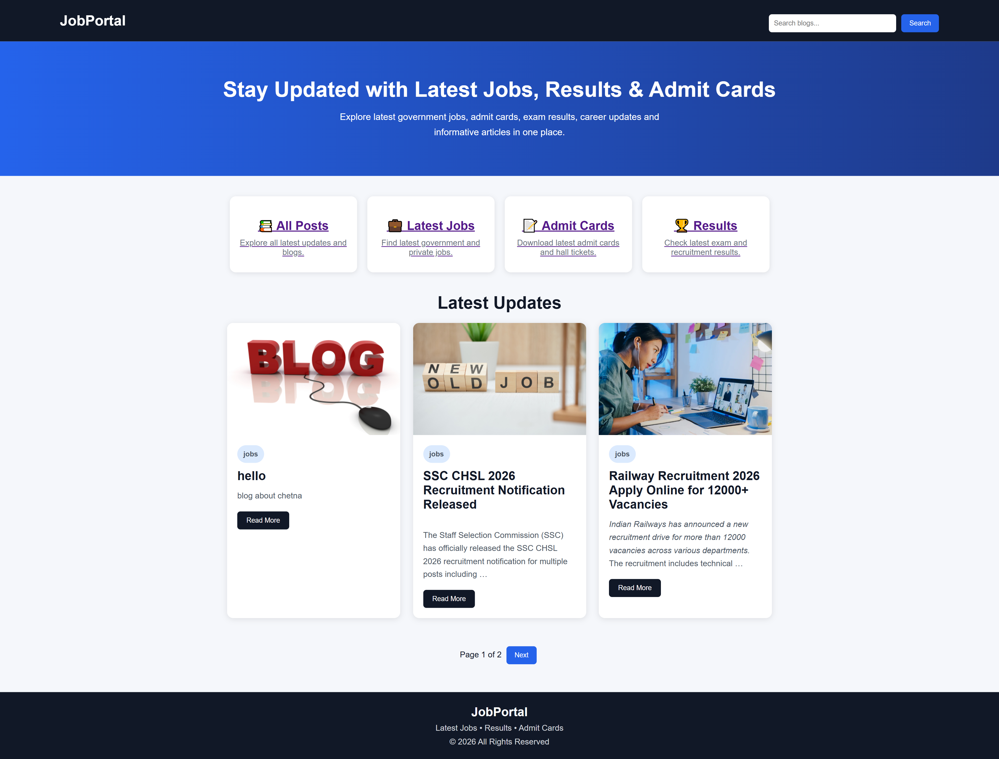
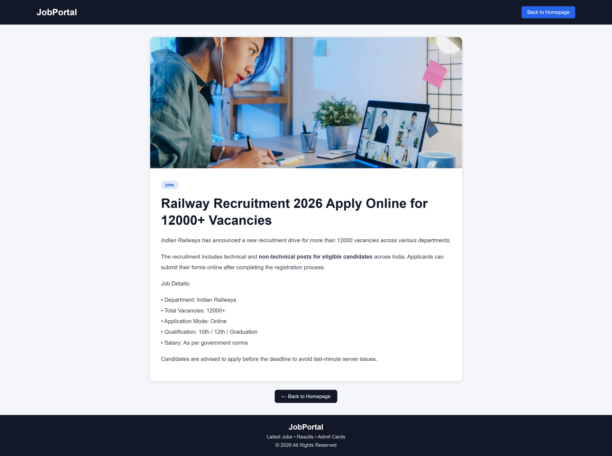
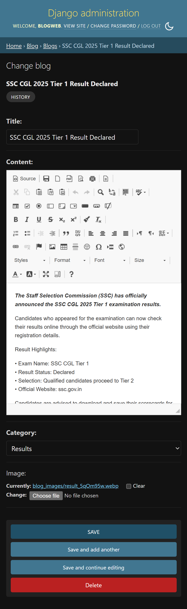
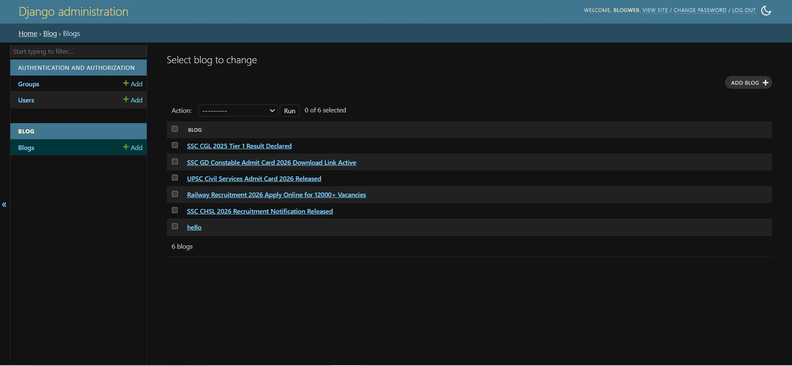

# Django Job Portal Blog

A modern Django-based blog portal for publishing latest jobs, admit cards, results and career updates.
## 🌐 Live Demo
🔗 https://django-job-portal-blog.onrender.com

## Features
- Django Admin Panel
- Add/Edit/Delete Blogs
- CKEditor Rich Text Editor
- Image Upload Support
- Search Functionality
- Category Filters
- Pagination
- Responsive UI
- Blog Detail Page
- Mobile Friendly Design
## Technologies Used
- Python
- Django
- HTML
- CSS
- CKEditor
  
## Deployment
Render
Open Project Folder

## screenshort
  
  
  
  

### Clone the repository
git clone https://github.com/chetnagaikwad/django-job-portal-blog.git
### Open project folder
cd django-job-portal-blog
### Create virtual environment
python -m venv venv
### Activate virtual environment (Windows)
venv\Scripts\activate
### Install dependencies
pip install -r requirements.txt
### Run migrations
python manage.py migrate
### Start server
python manage.py runserver
